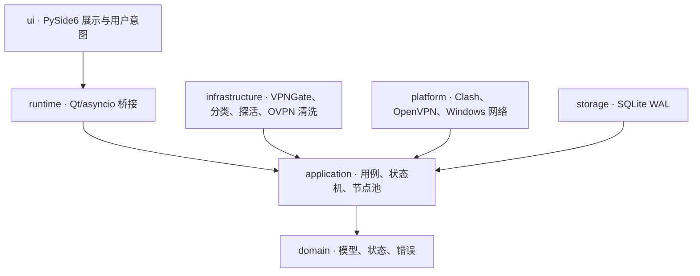
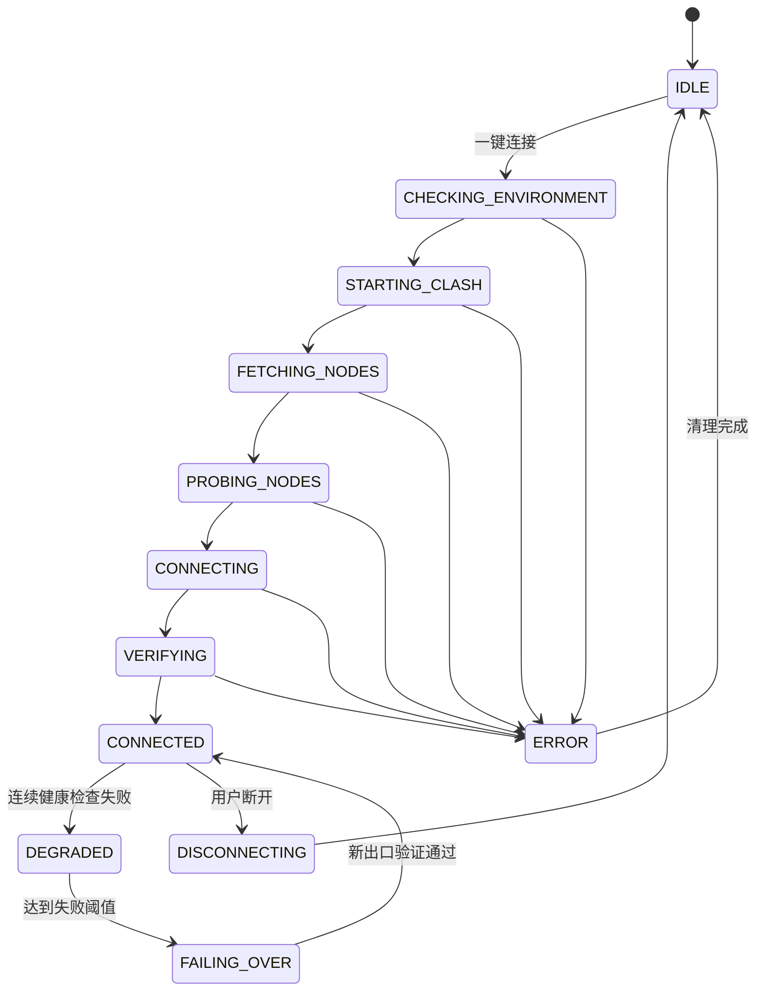

# 架构说明

## 设计目标

- UI、业务策略、远程数据源和 Windows 系统副作用相互独立；
- 外部服务通过端口协议替换，核心流程可在无真实网络环境下测试；
- 连接状态和系统变更只有一个所有者，避免并发连接、断开和刷新互相覆盖；
- 取消、失败、断开和下次启动都能幂等恢复程序修改过的状态；
- 公共节点、远程配置和本机第三方配置默认按不可信输入处理。

## 分层与依赖方向

依赖规则：

- `domain` 不导入 PySide6、HTTP、SQLite、子进程或 Windows API；
- `application` 只依赖领域模型和 `application.ports` 中的协议；
- `infrastructure`、`platform`、`storage` 是端口适配器；
- `ui` 只渲染快照并发出用户意图，不直接访问网络或启动进程；
- `main.py` 是组合根，负责实例化并连接所有实现。

## 运行时模型

Qt 主线程只处理界面。`DesktopBridge` 在专用 asyncio 事件循环中执行网络、SQLite 和子进程
操作，再通过 Qt Signal 将不可变快照送回界面。刷新、连接、断开、健康检查和故障切换共享
同一操作锁；只有 `ConnectionOrchestrator` 可以迁移连接状态。

## 节点事实模型

程序不使用一个含糊的“在线”字段，而是分别记录：

1. 节点是否仍存在于当前 VPNGate 列表；
2. TCP 端点是否可达；
3. 多数据源是否接受其为严格家宽；
4. OpenVPN 初始化是否完成；
5. 隧道内互联网是否可达；
6. 实测公网 IP、国家和 ASN 是否匹配所选节点。

候选分类和 TCP 探活有并发上限并使用缓存；只有活动连接执行高频端到端健康检查。节点连续
失败后进入冷却，自动切换优先选择同国家的高质量节点。

## 系统变更所有权

每次系统代理、路由或临时配置变更都会记录原值与所有权元数据。恢复操作可重复执行，并遵循：

- 只停止本程序启动的进程；
- 只恢复本程序修改的代理状态；
- 自动修复只删除归属明确的 OpenVPN/TAP/Wintun 残留路由；
- 归属不明确的 `/1` 分流路由只在界面列出目标网段、下一跳和接口编号，并经用户二次确认后精确删除；
- 检测到外部 `openvpn.exe` 时报告冲突，不强制终止；
- 无法确认所有权时保持系统原状并向用户报告。

## 安全边界

- VPNGate CSV 中的 IP 是信任锚，嵌入配置不得把 `remote` 重定向到其他地址；
- OpenVPN 配置拒绝脚本、插件和可执行钩子，只输出允许的安全指令；
- Clash 上游 IP 在 OpenVPN 改写默认路由前获得显式 `net_gateway` 主机路由，防止链路回环；
- Windows 使用 `block-outside-dns` 限制隧道外 DNS，断开后刷新 DNS 缓存；
- 子进程使用参数数组和绝对可执行文件路径，不使用 `shell=True`；
- Clash 控制器凭据仅驻留内存，不写日志；
- SQLite 使用 WAL，设置文件使用临时文件替换，降低异常退出造成的损坏。

## 数据位置

默认运行目录为 `%LOCALAPPDATA%\ResidentialIPManager`，包含设置、SQLite 状态库、分类缓存、
滚动日志、网络快照和临时安全配置。仓库的 `.gitignore` 会排除这些文件及常见凭据扩展名。
