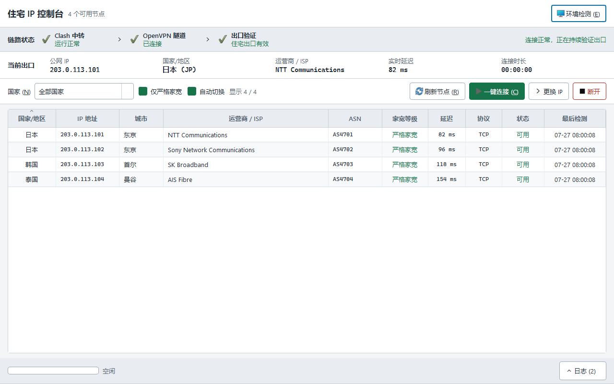
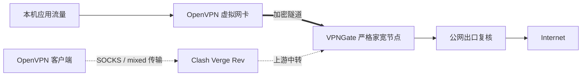
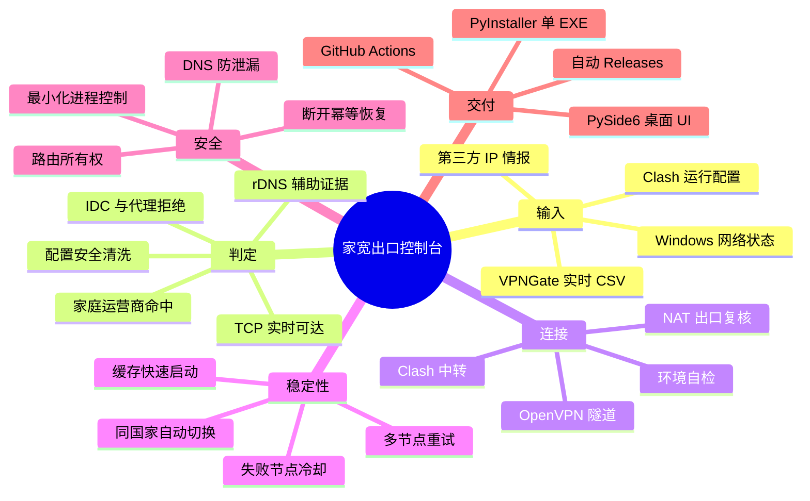
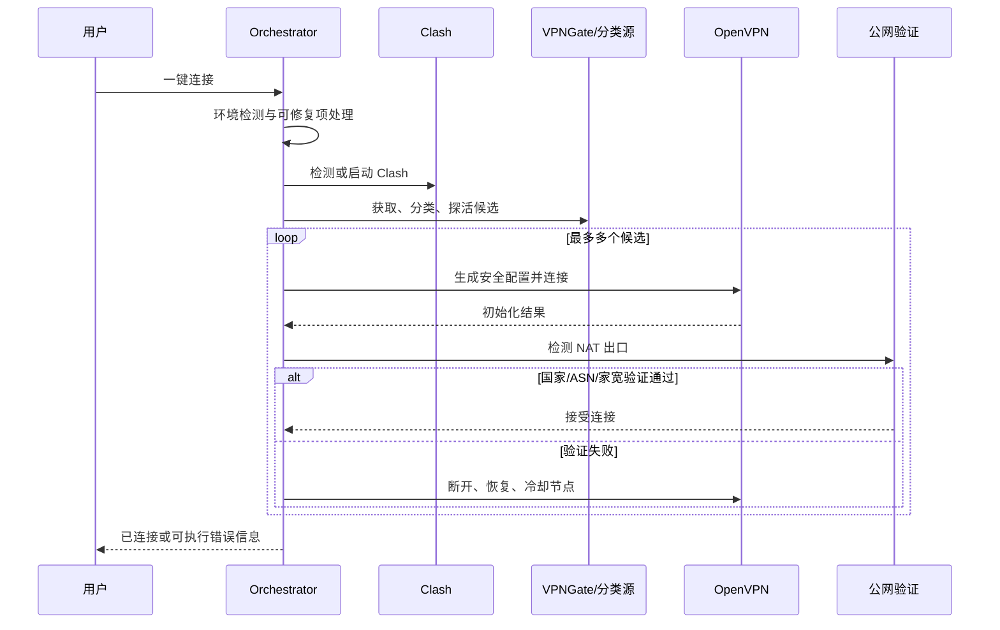

<div align="center">
  
  <h1>家宽出口控制台</h1>
  <p>通过 Clash 中转连接 VPNGate，并只呈现经过严格判定和实时探活的家庭宽带出口。</p>
</div>

<p align="center">
  <a href="https://github.com/Guli-Joy/residential-ip-manager/actions/workflows/ci.yml"></a>
  <a href="https://github.com/Guli-Joy/residential-ip-manager/releases/latest"></a>
  <a href="https://github.com/Guli-Joy/residential-ip-manager/releases"></a>
  <a href="https://www.python.org/"></a>
  <a href="#环境准备"></a>
  <a href="LICENSE"></a>
</p>



## 项目定位

家宽出口控制台是一个 Windows 桌面链路编排器，不是代理订阅服务，也不维护静态 IP 名单。
它实时读取 VPNGate 公共节点，通过 Clash Verge Rev 的本地代理完成 OpenVPN 握手中转，再对
候选节点执行多数据源住宅属性判定、TCP 探活和最终 NAT 出口复核。

最终界面只显示同时满足 **严格家宽** 与 **当前可达** 的节点。国家列表来自每次实时结果，
不会用固定国家名单制造“全国家可用”的假象。

> [!IMPORTANT]
> 公共 VPN 节点和第三方 IP 情报会持续变化。本项目采用保守规则降低 IDC、代理、VPN 和移动
> 网络误判，但不能承诺某个 IP 永久属于住宅网络，也不能替代对节点运营者的信任评估。

## 核心能力

| 能力 | 实现要点 |
| --- | --- |
| 实时节点获取 | Clash 代理优先访问 VPNGate，国内直连回退，失败时使用本地缓存保持可操作 |
| 严格住宅判定 | `ip-api`、`ipapi.is`、rDNS、ASN/ISP 与家庭运营商规则交叉验证 |
| 安全配置处理 | 校验 CSV 公网 IP 与 OVPN `remote` 一致，拒绝脚本、插件和危险指令 |
| 可用性检测 | 有并发上限的 TCP 探活、失败冷却、活动出口高频健康检查 |
| 链式连接 | Clash 负责 OpenVPN 传输中转；节点表右键可连接或切换到指定 VPNGate 出口 |
| 出口复核 | 连接后重新检测公网 IP、国家、ASN 和住宅属性，失败即回滚并尝试下一节点 |
| 自动恢复 | 一键连接最多尝试多个候选；连续失败达到阈值后优先同国家切换 |
| DNS 防泄漏 | Windows Filtering Platform 阻止隧道外 DNS，断开后恢复并刷新缓存 |
| 环境治理 | 检测 Clash、OpenVPN、TAP/Wintun、端口、冲突进程和残留路由 |
| 本地状态 | SQLite WAL 保存节点、快照和冷却状态，快速展示缓存后后台刷新 |
| 中文界面 | ISO 国家代码统一中文显示，默认按国家、延迟、数值 IP 稳定排序 |

## 链路原理



Clash 只承载 OpenVPN 到 VPNGate 的底层连接。网站最终看到的是通过复核的 VPNGate 出口 IP，
不是 Clash 节点 IP。程序会在隧道建立前为 Clash 上游服务器写入明确的旁路主机路由，防止
OpenVPN 默认路由把中转连接再次卷入隧道。

## 产品思维图



## 严格家宽判定


判定采用“明确通过才接受”的策略：第三方结果未知、来源冲突、命中 IDC 关键词或缺少可确认
的 ISP/家庭运营商证据时，都不会升级为严格家宽。rDNS 是辅助证据，查询失败本身不会直接
判为 IDC。连接后还要求出口国家和 ASN 与目标节点一致。

## 环境准备

| 组件 | 要求 | 说明 |
| --- | --- | --- |
| Windows | Windows 10/11 x64 | 路由、WFP DNS 和进程检测依赖 Windows |
| Clash | [Clash Verge Rev](https://github.com/clash-verge-rev/clash-verge-rev) | 启动并选择可用节点；建议启用 mixed port 和 external controller |
| OpenVPN | [OpenVPN Community](https://openvpn.net/community-downloads/) | 默认检测 `C:\Program Files\OpenVPN\bin\openvpn.exe` |
| 虚拟网卡 | TAP-Windows6 或 Wintun | 通常随 OpenVPN Community 安装 |
| 权限 | 管理员 | EXE 清单默认请求 UAC，用于隧道、路由和 DNS 策略 |
| Python | 3.12–3.14，仅源码运行需要 | Release 单文件版不要求安装 Python |

环境检测会核对 Windows、管理员权限、OpenVPN、虚拟网卡、Clash 配置与进程、mixed/SOCKS/
controller 端口、外部 OpenVPN 冲突和残留分流路由。自动修复只在 `openvpn.exe` 已退出、
目标接口属于 OpenVPN/TAP/Wintun 且用户确认后，按目标网段和接口编号精确删除残留路由。

## 快速开始

### 使用 Release 单文件版

1. 从 [Releases](https://github.com/Guli-Joy/residential-ip-manager/releases/latest) 下载
   `ResidentialIPManager.exe` 和 `SHA256SUMS.txt`；
2. 安装并启动 Clash Verge Rev，选择一个稳定中转节点；
3. 安装 OpenVPN Community，并断开 OpenVPN GUI 中已有的活动连接；
4. 双击 EXE，接受一次 Windows UAC；
5. 打开“环境检测”，处理所有必需项；
6. 刷新节点，按国家筛选后选择节点，或直接点击“一键连接”；连接后可右键目标行切换到指定节点。

PowerShell 校验下载文件：

```powershell
Get-FileHash .\ResidentialIPManager.exe -Algorithm SHA256
Get-Content .\SHA256SUMS.txt
```

### 从源码启动

最省事的方式是双击 `start_app.vbs`。它会无终端创建 `.venv`、安装缺失依赖并启动程序。

手动方式：

```powershell
git clone https://github.com/Guli-Joy/residential-ip-manager.git
cd residential-ip-manager
python -m venv .venv
.\.venv\Scripts\python.exe -m pip install --upgrade pip
.\.venv\Scripts\python.exe -m pip install -e ".[dev,build]"
.\.venv\Scripts\python.exe -m residential_ip_manager.main --no-elevate
```

## 一键连接流程



## 项目结构

```text
residential-ip-manager/
├─ .github/workflows/       # CI 与标签触发的 Windows Release
├─ docs/images/             # README 界面预览
├─ scripts/                 # 环境安装、图标生成与 EXE 构建脚本
├─ src/residential_ip_manager/
│  ├─ application/          # 状态机、节点池、端口协议和用例编排
│  ├─ assets/               # SVG、PNG、ICO 应用图标
│  ├─ domain/               # 领域模型、状态和错误码
│  ├─ infrastructure/       # VPNGate、住宅分类、探活、OVPN 安全生成
│  ├─ platform/             # Clash、OpenVPN 与 Windows 网络控制器
│  ├─ storage/              # SQLite WAL 持久化
│  ├─ ui/                   # PySide6 界面、模型、中文国家映射和主题
│  ├─ main.py               # 依赖组合根与桌面入口
│  └─ runtime.py            # Qt 主线程与 asyncio 后台桥接
├─ ARCHITECTURE.md          # 模块边界、状态机和安全约束
├─ SECURITY.md              # 漏洞报告与信任边界
├─ pyproject.toml           # 依赖、工具链与包元数据
└─ residential_ip_manager.spec
```

更完整的模块边界和状态机见 [ARCHITECTURE.md](ARCHITECTURE.md)。

## 本地数据与隐私

运行数据只写入 `%LOCALAPPDATA%\ResidentialIPManager`：

| 文件 | 用途 |
| --- | --- |
| `settings.json` | 国家筛选、自动切换和探活参数 |
| `state.db` / WAL | 节点、连接快照、失败次数和冷却状态 |
| `classification_cache.json` | 第三方分类与 rDNS 缓存 |
| `network_snapshot.json` | 仅记录程序需要恢复的网络状态 |
| `runtime/` | 当前会话生成的安全 OpenVPN 配置 |
| `logs/` | 滚动运行日志和 OpenVPN 诊断信息 |

程序不收集遥测。住宅判定会把候选公网 IP 发送给 README 中列出的第三方 IP 情报服务；Clash
订阅地址、控制器密钥和代理凭据不应进入日志，也不会提交到仓库。

## 构建与自动发布

本地构建单文件 EXE：

```powershell
.\.venv\Scripts\python.exe -m pip install -e ".[build]"
powershell -NoProfile -ExecutionPolicy Bypass -File .\scripts\build_exe.ps1
```

产物为 `dist\ResidentialIPManager.exe`，使用 PyInstaller `--onefile` 等价配置、无控制台窗口、
内嵌多尺寸图标并默认要求管理员权限。Clash 和 OpenVPN 作为外部环境依赖，不重复塞入 EXE。

自动发布规则：

```powershell
git tag v0.1.2
git push origin v0.1.2
```

`release.yml` 会在 `windows-latest` 上执行 Ruff、Pyright、源码编译、依赖检查和 EXE 构建，随后
生成 `SHA256SUMS.txt`，上传构建 Artifact，并创建带自动发行说明的 GitHub Release。

## 开发与验证

```powershell
.\.venv\Scripts\python.exe -m ruff check src scripts
.\.venv\Scripts\python.exe -m pyright
.\.venv\Scripts\python.exe -m compileall -q src
.\.venv\Scripts\python.exe -m pip check
```

## 常见问题

| 现象 | 处理 |
| --- | --- |
| 国家数量少 | 只统计当前同时通过严格分类和 TCP 探活的国家；稍后刷新不一定得到相同结果 |
| VPNGate 获取失败 | 先确认 Clash mixed port 可用；程序会依次尝试 Clash、国内直连和缓存 |
| OpenVPN 无法连接 | 断开 OpenVPN GUI 中已有连接，检查 TAP/Wintun 和环境检测中的残留路由 |
| 连接后出口不一致 | 程序会拒绝该节点并尝试下一候选；查看日志中的国家、ASN 或住宅证据差异 |
| DNS 检测显示泄漏 | 确认以管理员权限运行并查看 OpenVPN 日志是否成功安装 WFP block filters |
| 任务栏仍是旧图标 | 退出旧进程、取消旧固定项，再从最新 EXE 启动并重新固定 |

## 项目边界

- 仅支持 Windows 10/11；
- 不提供 Clash 订阅、OpenVPN 账号或私有住宅代理；
- 不绕过网站风控，也不保证匿名性、解锁能力或节点可信度；
- VPNGate、`ip-api`、`ipapi.is` 的可用性和服务条款由各自提供方负责；
- 使用者应遵守当地法律、网络服务条款和 VPNGate 使用政策。

## 贡献与安全

提交 PR 前请运行完整质量命令，并保持模块依赖方向不被破坏。普通缺陷使用
[Issues](https://github.com/Guli-Joy/residential-ip-manager/issues)；涉及凭据、路由越权、配置注入
或隐私泄露的问题请按 [SECURITY.md](SECURITY.md) 私密报告。

本项目采用 [MIT License](LICENSE)。
